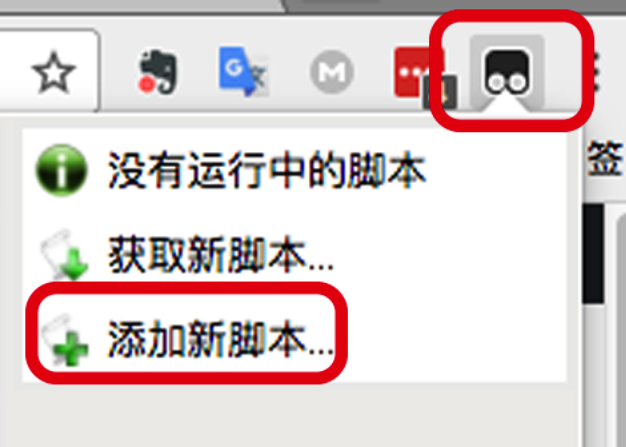
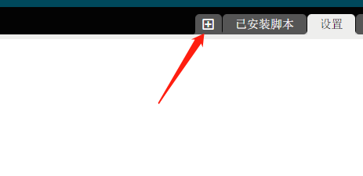
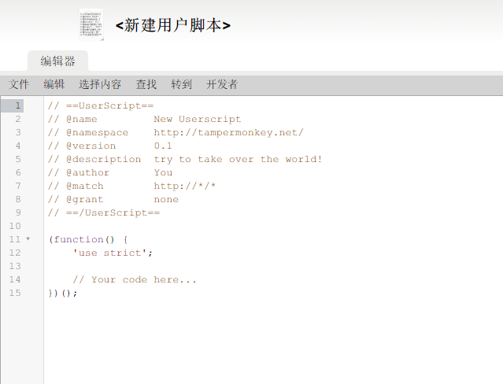

很多时候在搜索引擎上搜索到的 V2ex 网页都是手机版的，本脚本将自动将 V2ex 手机版网页转为 PC 版。

<!--more-->

## 1. 安装油猴插件

安装 chromeJS 脚本之前，先给浏览器安装一个管理脚本的扩展程序：[Tampermonkey](https://chrome.google.com/webstore/detail/tampermonkey/dhdgffkkebhmkfjojejmpbldmpobfkfo)。

## 2. 安装脚本

### 2.1 在线安装

将 Tampermonkey 安装好后，打开[将 V2ex 移动版网页转为 PC 版网页](https://greasyfork.org/zh-CN/scripts/389572-将v2ex移动版网页转为pc版网页)这个网页

点击 `安装`按钮，就安装成功了，后续脚本更新也会自动更新。

### 2.2 本地安装

点击这个



或者



进入新建脚本



将下面一段代码复制进去

```js
// ==UserScript==
// @name         将V2ex移动版网页转为PC版网页
// @namespace    None
// @version      0.1
// @description  将 V2ex 移动版网页转为 PC 版网页
// @author       Owovo
// @match        *://*.v2ex.com/amp/*
// @grant        none
// ==/UserScript==

(function(){
    location.href=document.URL.replace("/amp/","/")
})();
```

点击保存就完事啦~ 本地安装的坏处就是不能及时获得更新